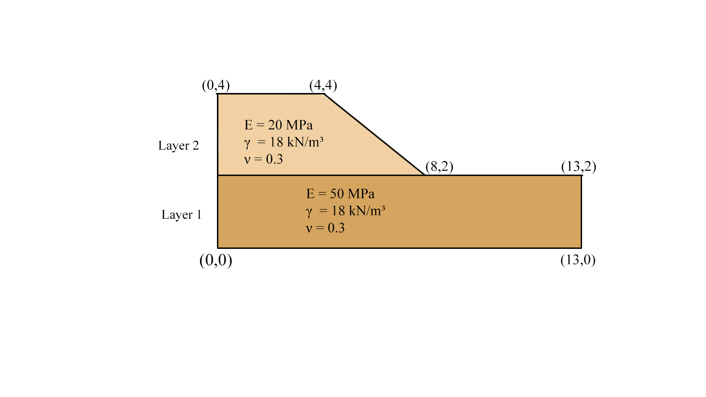
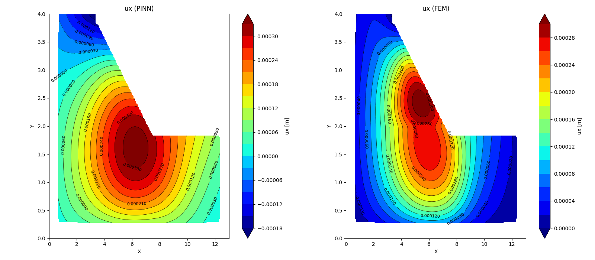
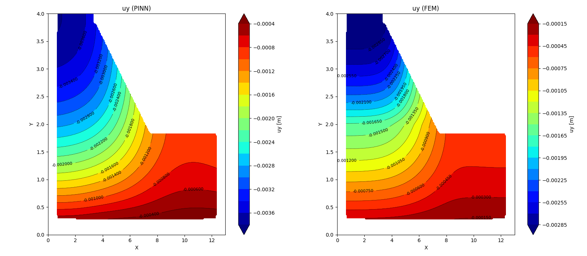
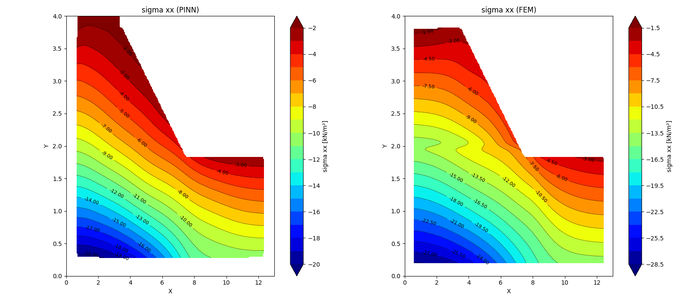
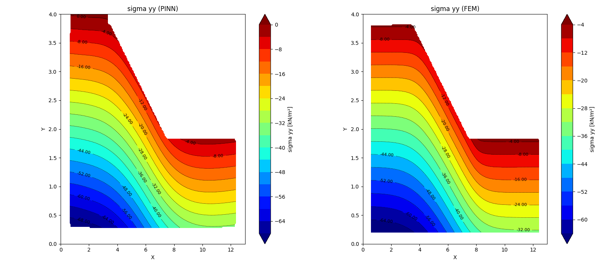
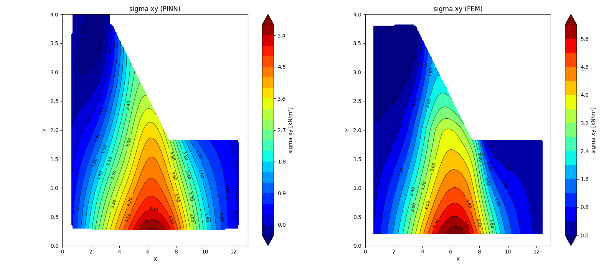

# PINNs-SlopeStability-MultiLayer

This project utilizes a **Physics-Informed Neural Network (PiNN)** to analyze slope stability in **multi-layered soil systems**. By integrating physical principles with neural network capabilities, it effectively predicts slope deformation and failure across different soil layers. 

## Overview

The PiNN models a 2D slope problem with **multi-layered soil** using physics equations (linear elasticity and gravity). It aims to predict slope stability similarly to traditional methods like the **Finite Element Method (FEM)**, while effectively capturing the interactions between different soil layers under load.


## Features
- Predicts slope stability in **multi-layered soil** systems using PiNN.
- Compares PiNN results with FEM.
- Shows displacement and deformation.
- Handles gravity loading.
- Exports displacement data for plotting.


## Model Details

The PiNN is trained using:
- **Physics equations**: 2D linear elastic 
- **Material parameters**:
  - Young's Modulus soil layer 1 (E): 50000 kN/m²   (for example) to compare with FEM from Plaxis2d
  - Young's Modulus soil layer 2 (E): 20000 kN/m²
  - Poisson's Ratio (ν): 0.3
  - Unit Weight (γ): 18 kN/m³ (for example) to compare with FEM from Plaxis2d
- **Boundary Conditions**: Fixed displacements on the bottom, left, and right sides.
  

## Result







## Installation

Install the necessary tools using:

```bash
pip install torch matplotlib numpy
pip install pandas
pip install pytorch

